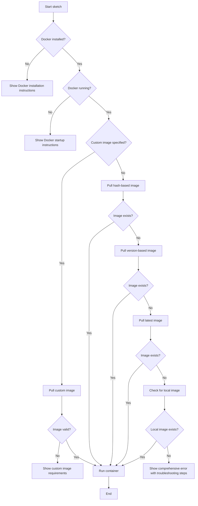

# Design Document

## Overview

This design document outlines the approach to fix the Docker image pulling issue in the sketch tool. The current implementation generates a tag based on a hash of the Dockerfile content, but if this specific image doesn't exist in the registry, the tool fails. We'll implement a more robust fallback mechanism and improve the overall Docker image handling process.

## Architecture

The solution will maintain the current architecture where the sketch tool runs in a Docker container, but will enhance the Docker image handling logic to be more resilient. The key components involved are:

1. **Docker Image Management**: Handles the identification, pulling, and validation of Docker images
2. **Fallback Mechanism**: Provides alternative image sources when the primary one is unavailable
3. **Error Handling**: Provides clear, actionable error messages to users

## Components and Interfaces

### Docker Image Management

The Docker image management component will be enhanced to:

1. **Image Identification**:
   - Continue using the hash-based approach for precise version control
   - Add support for version-based tags that align with sketch releases
   - Implement a tag resolution strategy that tries multiple sources

2. **Image Pulling**:
   - Implement a cascading pull strategy that tries multiple tags
   - Add retry logic with appropriate backoff for transient network issues
   - Improve logging to help diagnose image pulling issues

3. **Image Validation**:
   - Add validation to ensure the image has the necessary components
   - Check for compatibility with the current sketch version

### Fallback Mechanism

The fallback mechanism will:

1. Try to pull the hash-based tag first (most specific)
2. If that fails, try to pull using the sketch version tag
3. If that fails, try to pull the "latest" tag
4. If all remote pulls fail, check for a locally cached image
5. Provide clear error messages if all options fail

### Error Handling

Improve error handling to:

1. Distinguish between different types of Docker errors (network, authentication, missing image)
2. Provide specific troubleshooting guidance based on the error type
3. Include links to documentation for common issues

## Data Models

### Docker Image Reference

```go
type DockerImageReference struct {
    Repository string // e.g., "ghcr.io/boldsoftware/sketch"
    Tag        string // e.g., "0bf5d63455834e4915a81d87f3963dc0", "v1.0.0", "latest"
    Digest     string // Optional: content-addressable identifier
}
```

### Docker Pull Strategy

```go
type DockerPullStrategy struct {
    References []DockerImageReference // Ordered list of references to try
    MaxRetries int                    // Maximum number of retries per reference
    RetryDelay time.Duration          // Delay between retries
}
```

### Error Types

```go
type DockerErrorType int

const (
    NetworkError DockerErrorType = iota
    AuthenticationError
    ImageNotFoundError
    DockerNotInstalledError
    DockerNotRunningError
    UnknownError
)

type DockerError struct {
    Type        DockerErrorType
    Message     string
    Suggestion  string
    OriginalErr error
}
```

## Error Handling

The error handling strategy will be improved to provide more actionable information:

1. **Network Errors**: Suggest checking internet connectivity, proxy settings, or firewall rules
2. **Authentication Errors**: Provide guidance on Docker login or credential setup
3. **Image Not Found**: Explain the fallback process and why it might have failed
4. **Docker Not Installed/Running**: Provide installation/startup instructions
5. **Unknown Errors**: Include Docker logs and suggest reporting the issue

## Testing Strategy

1. **Unit Tests**:
   - Test the tag generation logic
   - Test the fallback mechanism with mocked Docker responses
   - Test error classification and message generation

2. **Integration Tests**:
   - Test with actual Docker daemon but mocked registry responses
   - Test the complete image pulling workflow with various scenarios

3. **End-to-End Tests**:
   - Test the full sketch startup process with various Docker states
   - Test with network limitations to verify fallback behavior

4. **Manual Testing Scenarios**:
   - Fresh installation without cached images
   - Installation with outdated cached images
   - Various network conditions (slow, intermittent, offline)
   - Different Docker configurations and versions

## Implementation Considerations

1. **Backward Compatibility**: Ensure existing `-base-image` flag continues to work
2. **Performance**: Minimize the impact on startup time, especially when images are already cached
3. **Security**: Ensure image validation doesn't introduce security risks
4. **User Experience**: Provide clear progress indicators during image pulling
5. **CI/CD Integration**: Ensure Docker images are published as part of the release process

## Diagram

