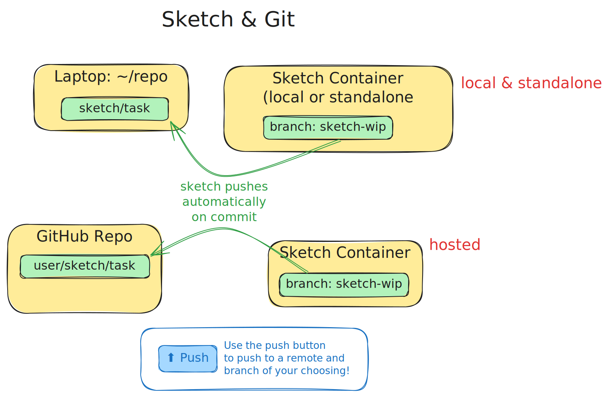

# Sketch and your Git Repo

Every Sketch session has its own container with its own clone of your git repo. The Sketch session
is initialized at a specific commit (either the HEAD where you started Sketch from the command
line or the branch you started with from the browser). The Sketch session always uses the branch
`sketch-wip`.

When Sketch makes its changes, Sketch automatically pushes those changes upstream, with branch
names that reflect the session. These branch names are indicated in the UI.

## When your container is local

If you started Sketch from your own machine, there are typically three repos in play. For example,
in the GitHub scenario, there is the GitHub repo, your laptop's clone of that repo, and the Sketch
container's clone of that repo.

Sketch will only automatically push changes to your laptop's clone, but you can use the Push
button in the UI to push changes all the way back to GitHub, to a branch of your choosing.

## Using Sketch for git operations

Ask Sketch to squash your commits, fetch and rebase, etc. It does a good job of it!

## Checking out Sketch's changes

Common ways to check out Sketch's changes include:

1. Create a new branch and `git reset --hard sketch/foo`
2. Check out `sketch/foo`. (Note that this may cause Sketch to start making changes to
   `sketch/foo2`, because when running locally, Sketch cannot push to a checked out
   branch.)
3. Cherry-pick changes in sketch/foo that aren't in HEAD with
   `git cherry-pick $(git merge-base HEAD sketch/foo)...sketch/foo`
4. Fetch with ssh integration (`git fetch ssh://dr5m-8xjv-tt8b-nxst@sketch.dev/app`) and
   operate on FETCH_HEAD.

What you use is up to you, but we also recommend trying to not check out Sketch's changes, and
iterate inside the container, where Sketch can help you out.
