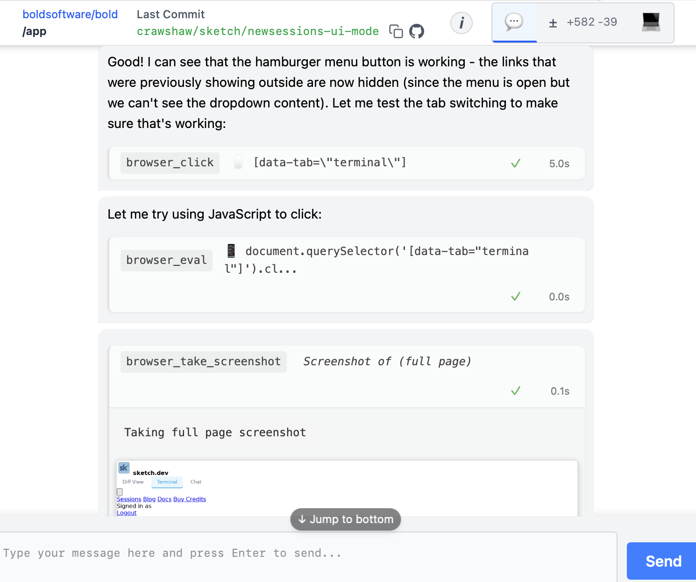

# The Sketch Web Browser

Sketch includes a headless copy of Chromium in the standard container it uses, allowing the agent
to interact with software it is helping to develop.



One effective technique is using screenshots to test changes. LLMs are generally very good at
writing CSS, but given existing CSS they are about as effective at conceptualizing how it will
look as a human is looking at the CSS source. By taking screenshots and feeding the image into the
(multi-modal) model, Sketch can have an exact idea of how the CSS actually works.

While Sketch will usually start a server as a background process and take screenshots
automatically, you can prompt it to do so, ensuring that it will take the time to check the
rendering. You can do so by adding a prompt to the `dear_llm.md`
file in the root of your repository, like this:

```markdown
# dear_llm.md
- When doing work on HTML/CSS, use the browser to take screenshots to test changes.
```

If you notice sketch having trouble figuring out how to start your server, consider adding details
on how to do it to your `dear_llm.md` file.
